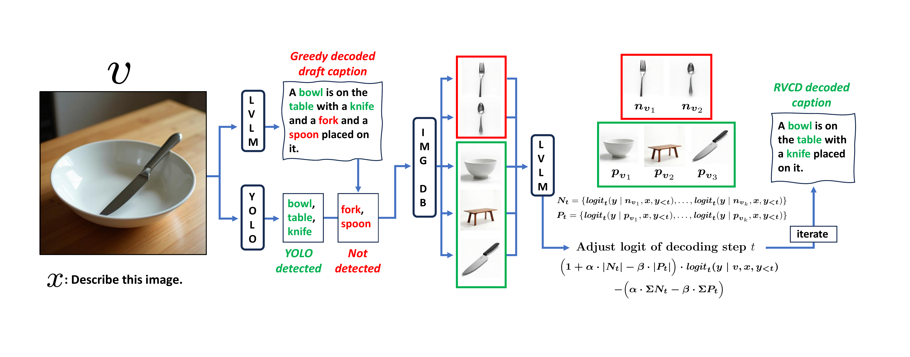

# Glimpse
If your goal here is to briefly verify the implementation of RVCD's overall concept, observe the following file:<br>
[`/MAIN_CODES/rvcd_generation_chair_bleu.py`](/MAIN_CODES/rvcd_generation_chair_bleu.py)

# Install
```bash
git clone https://github.com/JiHoonLee9898/RVCD.git
cd RVCD
conda env create -f environment.yml
conda activate RVCD
cd MAIN_CODES
```

### LVLM backbones setting
Download https://huggingface.co/liuhaotian/llava-v1.5-7b and specify it on **line 14** of the following files:
```plaintext
MAIN_CODES/eval_configs/prior_decoding_yamls/not_rvcd_llava.yaml
MAIN_CODES/eval_configs/llava-1.5_eval.yaml
```

Download https://huggingface.co/Vision-CAIR/vicuna-7b and specify it on **line 18** of the following files:
```plaintext
MAIN_CODES/minigpt4/configs/models/minigpt4_vicuna0.yaml
MAIN_CODES/minigpt4/configs/models/not_rvcd_minigpt4_vicuna0.yaml
```

Download https://huggingface.co/MAGAer13/mplug-owl2-llama2-7b and specify it on **line 14** of the following files:
```plaintext
MAIN_CODES/eval_configs/mplug-owl2_eval.yaml
MAIN_CODES/eval_configs/prior_decoding_yamls/not_rvcd_mplug_owl2.yaml
```

Specify the **absolute path** to `RVCD/MAIN_CODES/prerained_minigpt4_7b.pth` on **line 8** of the following files:
```plaintext
MAIN_CODES/eval_configs/minigpt4_eval.yaml
MAIN_CODES/eval_configs/prior_decoding_yamls/not_rvcd_mini_gpt4_vicuna0.yaml
```

### DINO for HALC
```bash
export CUDA_HOME=$CONDA_PREFIX
cd decoder_zoo/GroundingDINO
pip install -e .
cd ../..
```

Save the file downloaded from
https://drive.google.com/drive/folders/1UaMJga-BKju88CXAdonbiQujBKkdcVGX
to: 
```plaintext
MAIN_CODES/decoder_zoo/GroundingDINO/weights/groundingdino_swint_ogc.pth
```

# Arguments
Refer to the example in [`RVCD/MAIN_CODES/run_example.sh`](/MAIN_CODES/run_example.sh). Each block in the file (a total of 6) generates output captions for evaluating CHAIR/BLEU, POPE, and MME for RVCD and prior methods.
Please note that this is just an example; in practice, you need to provide the **absolute paths** specific to your environment for each argument.

### RVCD Arguments detail
| Argument       | Default    | Description                                                |
|----------------|------------|------------------------------------------------------------|
| `--model`      | llava-1.5  | Model to use. Options: [`llava-1.5`, `minigpt4`, `mplug-owl2`]. |


`--ref_folder_path`<br>
The absolute path to:
```plaintext
RVCD/DB_single_concept_images_flux_generated/generated_images
```

`--data_path` <br>
The absolute path to:
```plaintext
/coco2014 
```

`--data_path` is `[COCO_DIR]`.

Note that `[COCO_DIR]` is expected to contain both images and annotation files within the annotations subfolder. In other words, `[COCO_DIR]` must follow the structure:

```plaintext
COCO_DIR (val2014 for example)
├── annotations
│   ├── captions_val2014.json
│   ├── instances_train2014.json
│   ├── instances_val2014.json
│   ├── person_keypoints_train2014.json
│   ├── person_keypoints_val2014.json
├── COCO_val2014_000000000042.jpg
├── COCO_val2014_000000000073.jpg
...
```

`--coco_path`<br>
For required case (rvcd for mme), likewise, the **absolute path** to `/coco2014` (`[COCO_DIR]`).

`--chair_cache_path`<br>
The absolute path to:
```plaintext
RVCD/MAIN_CODES/eval/CHAIR_CACHE/chair.pkl
```

`--yolo_version`<br>
The default detector is `'yolov8x.pt'` from ultralytics(https://github.com/ultralytics).

| Argument        | Default | Description                                        |
|-----------------|---------|----------------------------------------------------|
| `--rvcd_alpha`  | 1       | Negative logits regulatory parameter. default: 1   |
| `--rvcd_beta`   | 0.1     | Positive logits recovery parameter. default: 0.1   |


## Prior decoding methods Arguments detail
| Argument   | Description                                                       |
|------------|-------------------------------------------------------------------|
| `--model`  | Choose one from: [`not_rvcd_llava`, `not_rvcd_mini_gpt4`, `not_rvcd_mplug_owl2`]. |
| `-d`       | Choose one from: [`greedy`, `dola`, `halc`, `opera`, `vcd`, `beam`]. |


`--data_paths` 
Note the difference from `--data_path`. Provide the **absolute path** to the MME benchmark dataset downloaded from (https://github.com/BradyFU/Awesome-Multimodal-Large-Language-Models/tree/Evaluation).

### HALC Additional Arguments
| Argument            | Default | Description                                                |
|---------------------|---------|------------------------------------------------------------|
| `--k-candidate-num` | 4       | Number of generative focal fields for local search.        |
| `--expand-ratio`    | 0.6     | The growing factor of focal fields.                       |
| `--detector`        | dino    | Detector to use. Options: [`dino`, `owlv2`].              |
| `--box_threshold`   | 0.4     | The threshold for bounding box in GroundingDino.          |


### OPERA Additional Arguments
| Argument               | Default | Description                                      |
|------------------------|---------|--------------------------------------------------|
| `--scale_factor`       | 50      | The scale factor to scale up the self-attention weights. |
| `--threshold`          | 15      | The threshold for attending retrospection.       |
| `--num_attn_candidates`| 5       | The number of candidates per beam.               |
| `--penalty_weights`    | 1       | The weight of penalty term in decoding.          |


### VCD Additional Arguments
| Argument        | Default | Description                                                     |
|-----------------|---------|-----------------------------------------------------------------|
| `--cd-alpha`    | 1       | Amplification factor.                                           |
| `--cd-beta`     | 0.1     | Truncation factor for adaptive plausibility constraint.         |
| `--noise-step`  | 500     | Number of steps to add diffusion noise.        


# EVALUATION
Refer to the specific examples in [`RVCD/MAIN_CODES/run_example.sh`](/MAIN_CODES/run_example.sh). Each block within the file (a total of 6) generates output captions for evaluating CHAIR/BLEU, POPE, and MME for both RVCD and prior methods. The evaluation assumes the existence of the generated captions.

### CHAIR/BLEU EVALUATION
Place the generated CHAIR/BLEU caption JSONL file under the `[absolute path of eval/test_folder]`.
Then, run the following command to generate the _chair.json file.
```plaintext
python eval/caption_to_chair2.py --gt-caption-path [absolute path to coco2014/annotations/captions_val2014.json] -c [absolute path of eval/test_folder]
```

Let the path to the generated `_chair.json` file be referred to as `[chair_path]`.

Finally, perform the evaluation by running:
```plaintext
python eval/eval_hallucination.py -v --metric chair --chair_input_path `[chair_path]`
```

### POPE EVALUATION
The POPE evaluation results are saved alongside the path where the POPE captions are generated.

### MME EVALUATION
Let the folder location where the generated MME captions are stored be referred to as `[mme_path]`.
Run the following command to perform the evaluation:
```plaintext
python eval/mme_tool/calculation.py --results_dir [absolute path to MAIN_CODES/eval/mme_tool/my_final_results] --captions_dir [mme_path]
```

# License
This repository is under BSD 3-Clause License(https://github.com/salesforce/LAVIS/blob/main/LICENSE.txt). Many codes are based on Lavis(https://github.com/salesforce/LAVIS), and https://github.com/BillChan226/HALC.